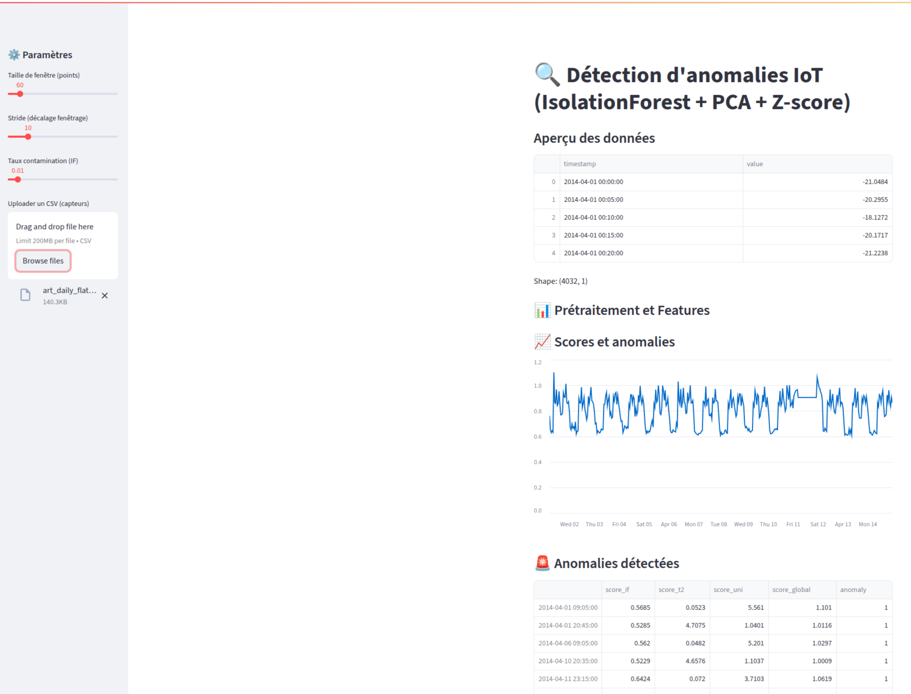

# 🚀 Détection d’anomalies IoT avec Isolation Forest



Ce projet illustre une méthode simple et robuste pour **détecter des anomalies** dans des données simulées de capteurs IoT (température, humidité, pression).  
Il utilise **Scikit-learn** pour le modèle de détection et **Streamlit** pour l’interface interactive.

---

## 📌 Objectif
- Simuler des données de capteurs IoT (avec quelques valeurs anormales).  
- Entraîner un modèle de **détection d’anomalies** (Isolation Forest).  
- Visualiser les résultats en temps réel avec **Streamlit**.
- Un modèle éprouvé (Isolation Forest) déjà utilisé en industrie.  
- Une interface claire pour la visualisation et l’interprétation.  
- Une structure facilement extensible (peut s’adapter à de vrais capteurs IoT).  

---

## 🛠️ Technologies utilisées
- **Python 3.10+**
- **Streamlit** → Interface web simple et rapide
- **Scikit-learn** → Modèle de machine learning
- **Pandas & NumPy** → Manipulation des données
- **Matplotlib / Seaborn** → Visualisation

---

## 📂 Structure du projet
📁 anomaly_detection_iot
│── main.py # Application principale Streamlit
│── requirements.txt # Dépendances Python
│── README.md # Documentation


---

## ⚡ Installation

1. **Cloner le projet**
```bash
git clone https://github.com/DHoudetot-Cyril/IoT-Anomaly-Detector.git
cd anomaly_detection_iot
```

Créer un environnement virtuel
```bash
python -m venv venv
source venv/bin/activate   # Linux/Mac
venv\Scripts\activate      # Windows
```

Installer les dépendances

```bash
pip install -r requirements.txt
```
▶️ Lancer l’application
```bash
streamlit run app.py
```
Cela ouvrira l’interface dans votre navigateur (généralement http://localhost:8501).

🖥️ Fonctionnalités de l’application
Génère des données IoT simulées (température, humidité, pression).

Applique Isolation Forest pour détecter les anomalies.

Affiche les résultats sous forme de graphique interactif.

Permet d’ajuster les paramètres du modèle (contamination, nombre d’estimateurs).

📊 Exemple de résultat
Les points normaux sont affichés en bleu.

Les points anormaux sont affichés en rouge.

🚀 Améliorations possibles
Connecter l’application à un vrai flux IoT (MQTT, API REST, Kafka…).

Enregistrer les anomalies détectées dans une base de données.

Ajouter d’autres algorithmes de détection (LOF, AutoEncoder).

Intégrer un système d’alerte en temps réel (mail, Slack, webhook).

📜 Licence
Projet open-source pour l’apprentissage et l’expérimentation.

